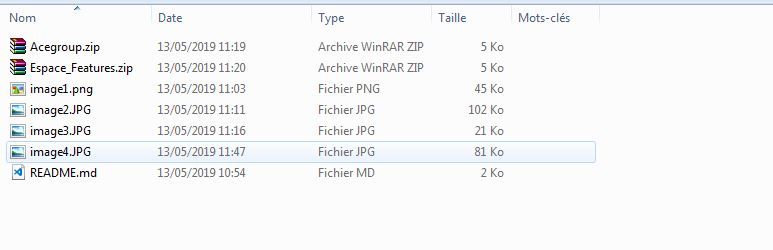

# Plugin-wp Répertoire membre et Espace docs

Bonjour.

Tout d'abord merci d'utiliser notre plugin.

Pour qu'il soit fonctionnel à 100%, veuillez couper les dossiers "Espace_Features" et "Repertoire_utilisateurs", et les coller à la racine du ftp.

Voir image

Après veuillez couper les documents suivants "template-feature.php" et "template-repertoire.php", et les collés à la racine de votre theme.

Voir image

Une fois que tout est fait, l'aperçu devrait ressembler à ceci.

Voir image 

Rendez-vous sur votre site à la partie wp-admin/plugins.php (Extensions), installer les plugins, activer les.

Une fois installé, ils vous restent plus cas crée les pages via le panel wordpress "PAGES" => wp-admin/edit.php?post_type=page 

Voir image

Dans Modèle vous-trouverez, FTP FEATURES ET FTP CLIENTS.

Si vous-trouvez des bugs, encore désolé, veuillez nous le signaller.
